<div align="center">
<h1 align="center">VideoPrinterTurbo</h1>
<br>
<h3>English | <a href="README_cn.md">简体中文</a></h3>
<br>
</div>


### A sister project to MoneyPrinterTurbo
### MoneyPrinterTurbo generates videos; VideoPrinterTurbo helps you create derivative videos
```
VideoPrinterTurbo Usage Notice and Disclaimer

VideoPrinterTurbo provides only video processing and assisted content creation features. It does not grant any rights to use third-party content. Users must ensure that their source materials and how they use them are lawful, obtain any necessary permissions, and comply with the rules of the relevant platforms. Creating derivative works, crediting the source, or using content for non-commercial purposes does not automatically exempt users from liability for infringement. This tool is provided as is, without any guarantee of the accuracy, legality, or suitability of its output. Users must review the output themselves before publishing it. Users bear liability under applicable law for their own unlawful or infringing conduct. This disclaimer does not exclude or limit any liability of the developers or providers that cannot legally be excluded or limited.
```

### What can VideoPrinterTurbo do?

+ Video downloading

  + VideoPrinterTurbo uses yt-dlp to download videos from most video websites.

    See the supported sites list: https://github.com/yt-dlp/yt-dlp/blob/master/supportedsites.md

  + For videos that cannot be downloaded, VideoPrinterTurbo offers a convenient plugin mechanism.

+ AI video translation

  + Pipeline: Download → ASR → LLM rewriting → Subtitle configuration → Final output

#### Original video:

[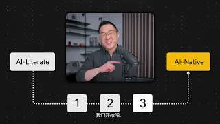](https://www.youtube.com/watch?v=E7YiKBeOneo&t=1s)

#### With translated subtitles:

[](https://www.youtube.com/watch?v=AiSW3_SyaKs)

+ AI video redubbing

#### With translated subtitles and new dubbing:

[](https://www.youtube.com/watch?v=08dmRF8JVaI)

+ Full video footage replacement

#### With translated subtitles, new dubbing, and replacement footage:

[](https://www.youtube.com/watch?v=321RVhF8ok8)

+ And more…
  + Explore other possibilities. If you have a new idea, please open an issue.

### System Requirements

+ Hardware requirements

| Component | Minimum | Recommended | Ideal |
| --------- | ------- | ----------- | ----- |
| CPU | 4 cores | 6–8 cores | 8 cores or more |
| RAM | 8 GB | 16 GB | 16 GB or more |
| GPU | Optional | 12 GB VRAM or more | 16 GB VRAM or more |

+ Software requirements
  + Windows 11, macOS 11.0 or later, or a major Linux distribution
  + Python 3.11
    + [Windows] https://www.python.org/ftp/python/3.11.9/python-3.11.9-amd64.exe
    + [macOS Homebrew] `brew install python@3.11`
  + Node.js 24
    + [Windows] https://nodejs.org/dist/v24.21.0/node-v24.21.0-x64.msi
    + [macOS Homebrew] `brew install node`
  + uv 0.12
    + `pip install uv`
  + yt-dlp
    + `pip install yt-dlp`
  + ffmpeg and ffprobe >= v7
    + The project only uses the ffmpeg and ffprobe command-line tools, without complex features or custom filters.
    + [Windows] https://www.gyan.dev/ffmpeg/builds/ffmpeg-release-essentials.7z
    + [macOS Homebrew] `brew install ffmpeg`

### Deployment Instructions

+ On Windows, install the software listed under “Software requirements”, then run `start.bat` in the project root.
+ On macOS or Linux, install the software listed under “Software requirements”, then run `start.sh` in the project root.
+ Options for `start.bat` and `start.sh`:

```text
start.xxx --help
  usage: -c [-h] [--mode {auto,cpu,cuda,mac}] [--check] [--reinstall] [--host HOST] [--backend-port BACKEND_PORT] [--frontend-port FRONTEND_PORT]

  Initialize and start VideoPrinterTurbo locally.

  options:
    -h, --help            show this help message and exit
    --mode {auto,cpu,cuda,mac}
    --check               Check prerequisites without installing or starting services.
    --reinstall           Run dependency installation again.
    --host HOST           IPv4 address for both services and the browser API URL (default: 127.0.0.1).
    --backend-port BACKEND_PORT
    --frontend-port FRONTEND_PORT
---------------------------------------------------------------------------------------
    --mode {auto,cpu,cuda,mac}
      auto  Let the startup script choose automatically.
      cpu   Run using the CPU.
      cuda  Run on a machine with NVIDIA CUDA installed.
      mac   Run on an Apple Silicon system.
    --host HOST
      The default bind address is 127.0.0.1.
      To access the application over a network, bind to a reachable IP address.
      For example, if your server's address is 192.168.0.101, run:
        start.xxx --host 192.168.0.101
      Then open http://192.168.0.101:5173 from another machine on the network.
      Note: You can ignore this option when running and accessing the application locally.
    --backend-port
      Backend port (default: 8080). Use this option to change it.
    --frontend-port
      Frontend port (default: 5173). Use this option to change it.
```

+ Docker deployment
  + Coming later.

### Tutorials

+ How to configure VideoPrinterTurbo
  + ASR configuration
    + What is ASR?
      + **ASR (Automatic Speech Recognition)** uses artificial intelligence and machine learning to automatically convert human speech into written text or commands.
      + VideoPrinterTurbo uses ASR to transcribe speech from videos, preparing the text for subsequent LLM and TTS processing.
    + How do I configure it?
      + **Note:** You only need to configure one service among the ASR configuration tabs. Select that service when creating a task; you do not need to configure every service.
    + What is **Whisper (Local ASR)**, and how do I configure it?
      + Whisper is an open-source speech recognition and transcription model from OpenAI. **Whisper (Local ASR)** means downloading the Whisper model directly to your local machine.
      + OpenAI Whisper (CPU)
        + Uses the official `whisper-large-v3-turbo` model.
        + CPU processing is slow and is provided for compatibility. It is not recommended for production workloads.
        + Model files require more than 5 GB of disk space.
      + MLX Whisper (recommended for Apple Silicon)
        + Uses `mlx-community/whisper-large-v3-mlx`.
        + Model files require more than 5 GB of disk space.
        + An M-series Pro processor is recommended.
        + At least 16 GB of unified memory is recommended.
      + Faster Whisper (recommended for NVIDIA GPUs)
        + Uses `Systran/faster-whisper-large-v3`.
        + At least 12 GB of VRAM and an RTX 3080 or better are recommended.
        + At least 5 GB of disk space is recommended for the model files.
      + 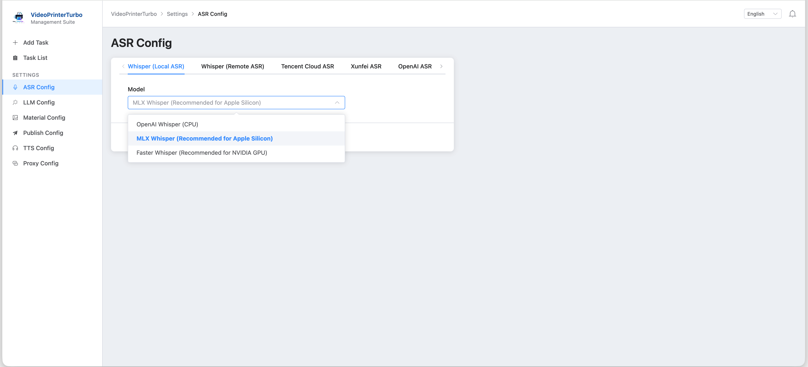
    + What is **Whisper (Remote ASR)**, and how do I configure it?
      + **Whisper (Remote ASR)** refers to a self-hosted Whisper service running on a server. This project supports deployment with vLLM or whisper.cpp.
      + Enter the address of your deployed service. For example, if whisper.cpp runs on server `192.168.0.1` at port `8004`, enter `http://192.168.0.1:8004/inference`.
      + 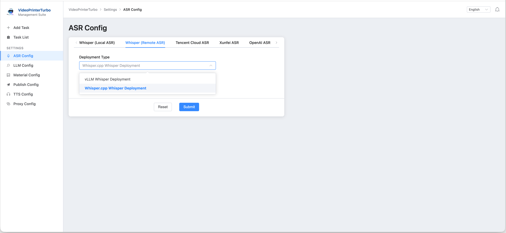
    + What is **Tencent Cloud ASR**, and how do I configure it?
      + Enter the ID and key provided by the cloud provider.
      + 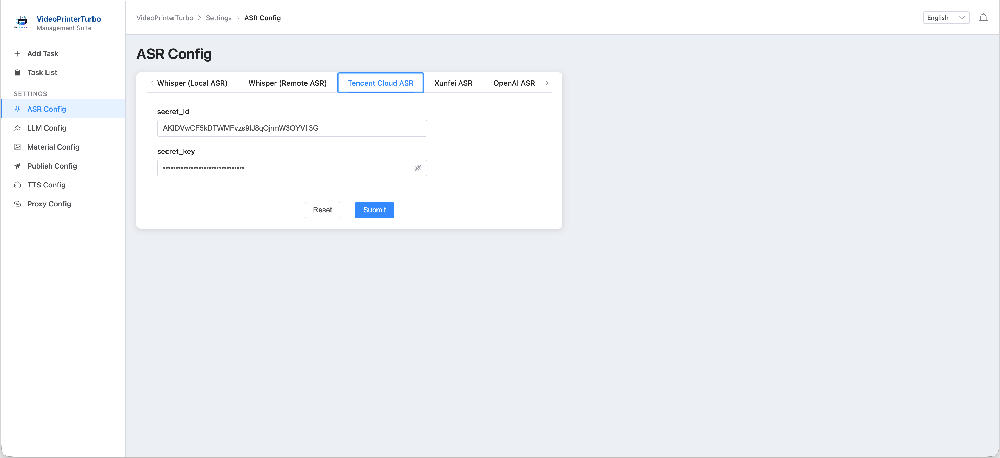
      + Configure the other cloud services in the same way as Tencent Cloud ASR.
  + LLM configuration
    + The LLM rewrites subtitle files and determines the content used in subsequent output, including AI-generated speech (TTS).
    + This project uses an OpenAI-compatible API format. The Claude API format is not supported.
    + The following example uses the official DeepSeek API.
    + 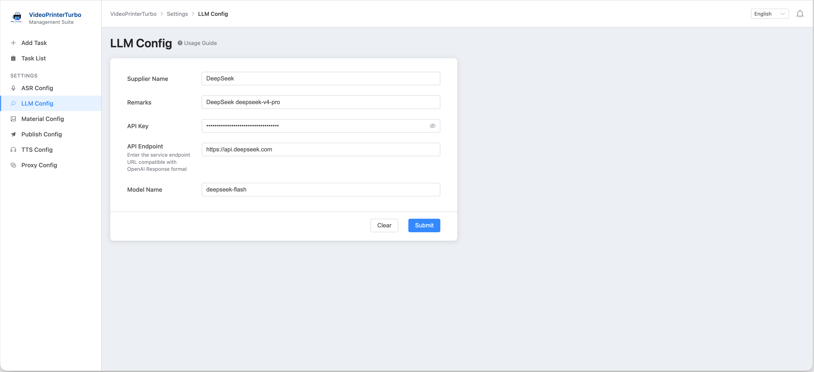
  + Stock media configuration
    + What is stock media used for?
      + For some derivative video workflows, such as quickly creating content similar to a short video you made with MoneyPrinterTurbo, you can use the stock media feature.
      + When adding a task, enable video footage replacement and enter video keywords. VideoPrinterTurbo searches the configured sites for matching stock media and uses it to replace the original video footage.
      + **Note:** If you leave the keywords blank, VideoPrinterTurbo uses the LLM (which must be configured) to extract a fixed number of keywords from the current subtitle file. These keywords may be inaccurate.
    + How do I configure it?
      + This project supports API keys for Pexels and Pixabay.
      + Apply for an API key on the corresponding website.
    + 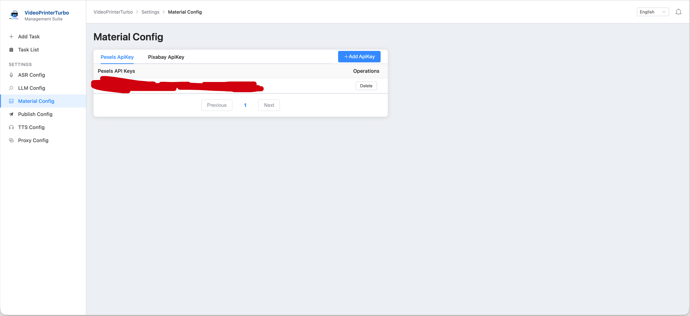
  + TTS configuration
    + What is TTS?
      + **TTS (Text-to-Speech)**, also known as speech synthesis, converts written text into natural, audible human speech.
      + You can think of it as the reverse of ASR. In VideoPrinterTurbo, TTS converts subtitles extracted by ASR and processed by the LLM back into speech, which is then merged into the final video.
    + How do I configure it?
      + Choose the service you want under **TTS Server**. Azure TTS V2 is recommended for its speed and fluency. When setting up Azure TTS V2, choose the **service region** closest to you and enter it correctly in the configuration.
    + 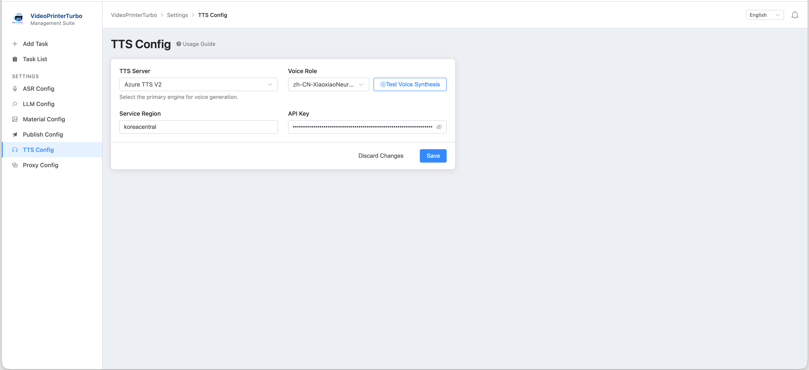
  + Proxy configuration
    + HTTP and SOCKS5 proxies are supported.
    + **Note:** Once a proxy is configured, you can enable it when adding a task. When enabled, all network operations use the configured proxy service.
    + 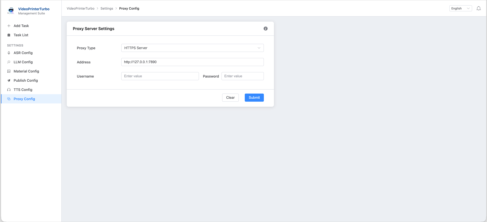

+ Start your first task
  + After completing the configuration, start with the simplest task: downloading a video.
  + Click **Add Task**.
  + Enter a link in the video download section, for example: https://www.youtube.com/watch?v=mUw27wG7uFA
  + 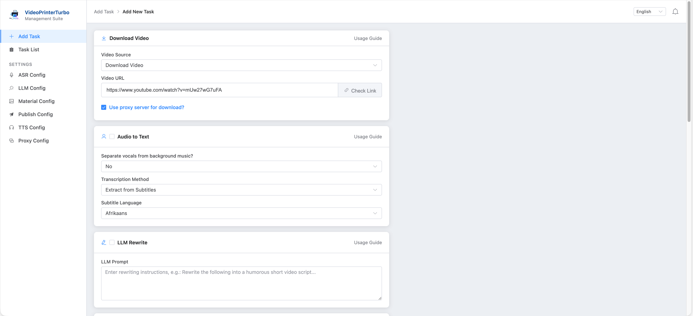
  + Click **Check Link** to check whether the link is available. **Note:** If the video requires a proxy to download, enable the proxy option before checking the link as well.
  + 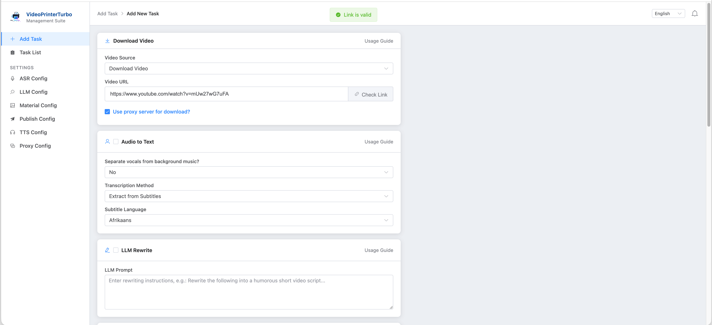
  + Once the check passes, click **Start Task** at the bottom to start downloading.
  + 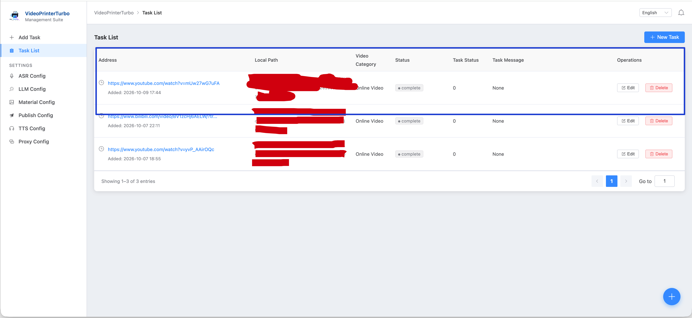
  + Wait for the task to finish. When its status shows that it is completed, the local path points to the downloaded video.

### Future Plans

+ If you have other needs, please open an issue.

### Acknowledgments

+ https://github.com/yt-dlp/yt-dlp
+ https://github.com/openai/whisper
+ https://github.com/streichgeorg/python-audio-separator
